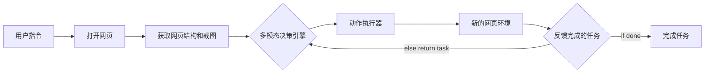

## 基于多模态大模型实现理解并自动化操作网页完成任务的agent设计
### 1. 项目背景和传统方法痛点
- 传统方法自动化操作网页是需要先手动操作一遍才能生成脚本，鲁棒性极弱且没有普适性
- 调用大语言模型的方法需要完整分析网页结构，但是网页结构可能不好，导致可操作元素和对应的描述结构上互相独立，例如什么
- 背景：复杂银行网页中的业务办理操作

### 2. 项目技术框架设计
涉及网页
- 原理

核心模块拆解
- 获取网页结构
    - html内容构造网页dom树（参考browser-use的index.js）
        - 通过 window._eventListenerTrackerInitialized 标记，确保脚本不会被重复注入。记录每个元素注册的事件监听器，用 WeakMap 存储每个元素的事件监听器信息
        - 给每个元素编号并框出
        - builddomtree
            - 节点类型判断与过滤:跳过无效节点（如高亮容器、非元素/文本节点、空文本、script 标签下的文本等）。对于 body 节点，作为根节点特殊处理，递归处理其所有子节点。
            - 文本节点处理:只处理有内容的文本节点。判断文本是否可见（isTextNodeVisible），并记录 text 字段和可见性。
            - 元素节点处理:先用 isElementAccepted 过滤掉如 script、style、svg 等无意义节点。视口快速过滤：如果元素明显在视口外，直接跳过（提升性能）。
            - 生成节点数据:记录 tagName、attributes、xpath、boundingBox 等基础信息。对交互候选元素、iframe、body 等，收集所有属性。计算可见性（isElementVisible）、是否顶层元素（isTopElement）、是否交互元素（isInteractiveElement）。根据高亮规则决定是否分配 highlightIndex 并高亮。
            - 递归处理子节点:对 iframe，递归其 contentDocument。对 contenteditable/rich text，递归所有子节点。对 shadow DOM，递归 shadowRoot。其他普通元素，递归其所有子节点，并传递高亮状态。
            - 特殊处理:跳过无内容、无尺寸的空 a 标签。每个节点分配唯一 id，最终返回 { rootId, map: DOM_HASH_MAP }
    -  构造提示词解释网页结构（prompt_generate.py）
        - 包含网页标题，地址，可用标签页以及网页上下翻页，此外最重要的网页信息
        - clickable_elements_to_string是把页面信息变成text传给大模型的，我们现在从页面DOM树根节点开始，中序遍历可点击节点，并把这个节点前的文本放在这个可点击元素的前面作为提示
- 提示词构造（main）
    - 构造详细的提示词
- 动作执行器（operate_web中的controller类）
    - 数据结构与模型
        - DOMTextNode / DOMElementNode：用于描述页面的文本节点和元素节点，包含标签名、xpath、属性、可见性、交互性等信息。
        - 各种 Action 参数模型（ClickAction、InputAction、SelectAction 等）：用 pydantic 定义，描述每种操作的参数格式。
        - ActionResult：操作结果的数据结构，包含 success、message、error、是否页面切换等字段。
    - WebRegistry
        - 用于注册和管理所有可用的网页操作（如点击、输入、滚动、选择等）。
        - 支持通过装饰器注册操作，并统一异步执行。
    - WebController
        - 提供 set_context、get_current_page、update_dom_elements、get_element_by_index/xpath 等方法。
        - 支持多种操作（点击、输入、下拉选择、滚动、导航、等待等），每种操作都注册为 action。
        - 支持通过字符串（如 "[操作：click，对象：8，内容：]"）直接执行操作，便于与大模型/自然语言接口集成。
        - 内部实现了多种元素定位和操作策略，兼容编号、xpath、选择器、文本等多种定位方式。
        - 针对 select2 等自定义下拉框有专门的滚动和选择逻辑。
### 3. 关键技术突破
- 多模态准确定位元素信息和位置
- 实现大模型自我纠错机制（历史信息）
### 4. 结果
### 5. 展望
业务迭代流程
- 纯文本误判多，对于现在的许多网页结构图片代表了这个链接的全部信息，无法让大模型理解（点赞）
- 大模型框结果位置再传，多次调用过于浪费提示词
- 纯图片，页面太大大模型识别困难（编号错判，类别错判，选择的点看不到），翻页意识弱
- 文本+图片

展望
- 缩减页面元素数量（把select元素等有用的隐藏信息传入，翻页提示以及非点击型元素类别传入）
- 使用大模型评测每次操作，原先的大模型对于操作有意义上的错判，导致task和实际操作结果不符。历史信息不能详细返回操作错误的原因，甚至输入错了输入框还会返回准确，需要引入新的大模型专用于评测结果，利用前后页面分析这次操作实际对应的操作是什么，并返回task是否完成，这个操作到底对应什么